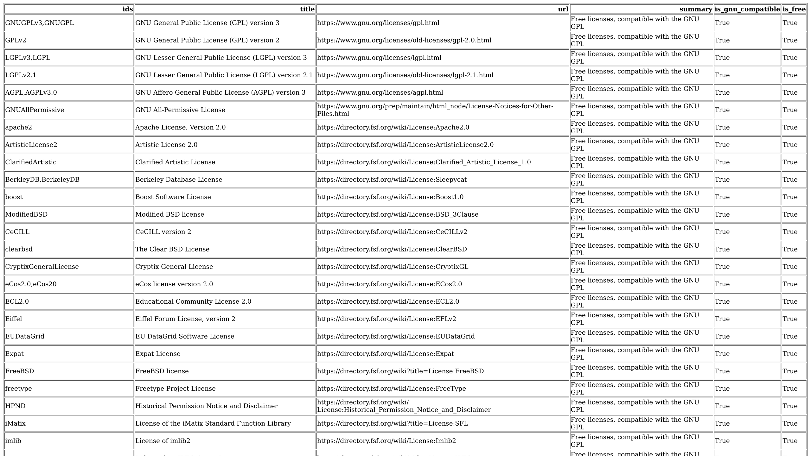

<h1 align="center">
  GNU Licenses Scraper
</h1>

<h4 align="center">A web scraper for GNU licenses list website and exporting to various formats</h4>

<p align="center">
  <a href="#about">About</a> •
  <a href="#usage">Usage</a> •
  <a href="#credits">Credits</a> •
  <a href="#license">License</a>

  <br>

  
</p>

## About

This is a web scraper for the GNU licenses list website. It scrapes the website and exports the licenses to various formats.
It uses the [GNU Licenses List](https://www.gnu.org/licenses/license-list.html) website as the source.

## Usage

Get the data from [the data directory](data/). The data is available in CSV, JSON, Excel and other formats.
To see a preview go to [the markdown file](data/licenses.md). It's also possible to generate the data by running the script below.

```sh
git clone https://github.com/cassiofb-dev/gnu-licenses-scraper

cd gnu-licenses-scraper

python -m venv venv

source venv/bin/activate

pip install -r requirements.txt

python -m src.main
```

## Credits

- [GNU Licenses List](https://www.gnu.org/licenses/license-list.html)
- [Python](https://www.python.org/)
- [Pandas](https://pandas.pydata.org/)
- [Requests](https://docs.python-requests.org/en/master/)
- [Beautiful Soup](https://www.crummy.com/software/BeautifulSoup/bs4/doc/)

## License

This project is licensed under Creative Commons Zero v1.0 Universal (CC0 1.0) in tandem with the Kopimi ideology.

- [Kopimi](https://kopimi.com)
- [Creative Commons Zero v1.0 Universal (CC0 1.0)](https://spdx.org/licenses/CC0-1.0.html)


